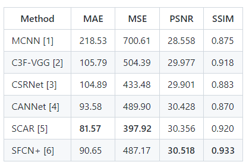
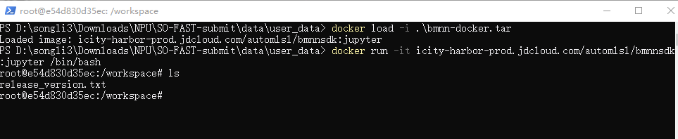

<center> <h1> 基于TPU平台实现人群密度估计 SO-FAST 题解 </h1> </center>

<hr/>

# 0. 文档结构介绍

<details>
<summary>文档结构</summary>
<pre>

```
SO-FAST-submit: SO-FAST队提交的所有参赛材料
| -- model
    | -- SFCN+-all_ep_321_mae_90.7_mse_487.2_nae_0.375.pth  : 预训练模型
    | -- traced_model_sfcn.pt                               : SFCN模型的traced_model
| -- scripts
    | -- main.sh                                            : 用于模型量化的脚本
| -- data 
    | -- user_data 
        | -- asserts                                        : 图片等
        | -- handled-testB                                  : 使用`data_handling.py`处理后的测
        试集
        | -- NWPU-Crowd                                     : 用于量化的数据集
        | -- sfcn_pytorch_model_u1                          : 量化SFCN模型时的中间结果，其他模型结果在SOPHGO-CCF-Contest中
        | -- Test-B                                         : 解压后的测试数据集
        | -- bmnn-docker.tar                                : docker环境： 下载链接：链接: https://pan.baidu.com/s/1Xf1iVibpIKftBXQF7vpc3A 提取码: 8888 
        | -- SOPHGO-CCF-Contest.tar.gz                      : 执行量化过程的中间结果 ：下载链接：https://pan.baidu.com/s/1tv3Y0at7j5wQnSoA-z9uZg 提取码：8888 
        | -- out.bmodel                                     : 提交的模型文件
        | --  SO-FAST-submit-sophgo.zip                     : 算能平台上用于测试的结果：下载链接：https://pan.baidu.com/s/1UEZZsjuHlL1h35EewLfpYA  提取码：8888 
    | -- prediction_result
        | -- val.txt                                        : 结果
    | -- code
        | -- data_handling.py                               : 对测试图片进行处理,用于生成测试文件
        | -- main.sh                                        : 测试的启动脚本
        | -- test_sail.py                                   : 测试的python脚本
        | -- TestDataSet_testB.txt                          : 测试图片的ID
    | -- README.md                                          : 说明文档的合集
```
</pre>
</details>


# 1. 赛题和相关资料

* 资料

    * 官网地址： https://www.datafountain.cn/competitions/583

    * 官方DEMO： https://github.com/sophon-ai-algo/contest-demos/tree/main/SOPHGO-CCF-Contest

    * NWPU-Crowd开源模型： https://github.com/gjy3035/NWPU-Crowd-Sample-Code

    * 算能官网： https://www.sophgo.com/site/index.html

    * 算能开发手册： https://developer.sophgo.com/site/index.html

    * 算能开发工程示例： 位于bmnnsdk的examples里

    * 预训练模型：http://share.crowdbenchmark.com:2443/home

    * **BM1684平台上使用的代码已打包到[./user_data/SO-FAST-submit-sophgo.zip](./user_data/SO-FAST-submit-sophgo.zip)**

    * **docker内用于编译模型的所有文件已打包到[./user_data/SOPHGO-CCF-Contest.tar.gz](./user_data/SOPHGO-CCF-Contest.tar.gz)**

    * **使用的docker环境已打包到[./user_data/bmnn-docker.tar](./user_data/bmnn-docker.tar)**

* 赛题分析：
  
    要求选用预训练的模型完成模型量化，在BM1684平台模型模型推理测试。需要关注模型在实际场景中部署的多个性能指标（模型精度、推理延时等）。团队的整体流程包括：
    
    * 预训练模型评估： 加载预训练模型在测试数据集上评估并记录模型的精度。
  
    * 模型量化：基于官方提供的量化教程进行模型量化。
      
    * 量化模型精度优化：通过筛选用于量化的图片提升量化速度和精度。
      
    * 模型推理加速：使用4N batch等方式进行加速，分析推理延时的瓶颈问题，并进行了针对性的优化，如图片的切割方式等。

# 2. 题解

1. 预训练模型评估

可供选择的预训练模型包括：`CSRNet`,`CANNet`,`SFCN`,`MCNN`,`SCAR`,`VGG`等,关于各模型的评估性能指标如下<sup>1</sup>：




我们同样评估和预训练模型在A榜的结果(不包括计算效率得分)，测试结果如下：

| Method | score |
| - | - | 
| CSRNet | 8.59 | 
| SCAR | 43.50 | 
| SFCN | 57.62 | 

**综上，可以从精度上看到各模型的指标对比，于是我们选择了`CSRNet`和`SFCN`两个模型同时进行量化** 

2. 模型量化，以`SFCN`模型为例，下面说明量化的具体步骤

* 环境配置：参考官方示例<sup>2</sup>，搭建用于模型量化的环境

    已经打包好的docker基础环境[env](./user_data/bmnn-docker.tar)

    * step 1: 加载并启动docker镜像

    ```
    docker load -i bmnn-docker.tar
    # Loaded image: icity-harbor-prod.jdcloud.com/automlsl/bmnnsdk:jupyter
    docker run -it icity-harbor-prod.jdcloud.com/automlsl/bmnnsdk:jupyter /bin/bash
    ```

    其中`icity-harbor-prod.jdcloud.com/automlsl/bmnnsdk`和`jypyter`分别是`{img_id}`和`{img_tag}`，可以使用`docker tag`更新为自己方便的名称。启动docker image以后的结果如下图：

    

    * 启动容器的最前面的字符串为容器id： `e54d830d35ec`,后续需要使用

    * step 2: 拷贝bmnnsdk到镜像环境并配置bmnn sdk

    bmnn sdk 可以通过官方下载: 
    `wget https://sophon-file.sophon.cn/sophon-prod-s3/drive/22/08/15/09/bmnnsdk2_bm1684_v2.7.0_20220810patched.zip`

    由于容器内下载太慢，还可能出现断网的情况，我们提前下载了文件，并通过下面的方式上传到容器内，
    在下载包所在的文件夹内打开cmd命令行：

    ```
    docker cp ./bmnnsdk2_bm1684_v2.7.0_20220810patched.zip e54d830d35ec:/workspace/
    ```
    其中`e54d830d35ec`为启动的容器id，`/workspace/`为容器内的目录。

    解压文件，配置bmnn sdk环境。

    ```
    # 解压
    unzip bmnnsdk2_bm1684_v2.7.0_20220810patched.zip
    cd bmnnsdk2_bm1684_v2.7.0_20220810patched
    # 解压缩SDK
    tar zxvf bmnnsdk2-bm1684_v2.7.0.tar.gz 
    # 安装bmnn依赖
    bmnnsdk2-bm1684_v2.7.0/scripts
    ./install_lib.sh nntc 

    # 激活环境
    source envsetup_cmodel.sh
    source envsetup_pcie.sh bmnetp 
    ```

    * step 3: 模型转换(所有代码和资源在NWPU-Corwd-Sample-Code下，以下指令均在改文件夹下执行)

    int8model的转换需要生成lmdb数据集，其中lmdbdataSet.txt是指定的用于量化的图片，这里我们选择了一张图片：NWPU-Crowd中的`img_0178.jpg`

    生成lmdb数据集的指令为：

    ```
    python3 gen_lmdb.py --img-path ./NWPU-Crowd --txt-path ./lmdbdataSet.txt --out-path ./lmdb
    ```

    为了使用算能提供的量化工具，需要生成traced_model,需要修改`model_tracing.py`中的模型类型为`Res101_SFCN`, 指令为：
    ```
    python3 model_tracing.py --input-shape '(1,3,576,768)' --weights-path pytorch_model/SFCN+-all_ep_321_mae_90.7_mse_487.2_nae_0.375.pth --out-path pytorch_model/traced_model.pt 
    ```

    我们使用算能提供的量化工具，进行模型量化，指令如下(对于SFCN模型量化过程需要32G的内存，对于CSRNet量化需要16G内存)：

    ```
    python3 -m ufw.cali.cali_model --net_name 'SFCN' --model ./pytorch_model/traced_model_sfcn.pt --cali_lmdb ./lmdb --cali_iterations 100 --input_shapes '(1,3,576,768)'
    ```

    为了支持线上的快速推理和`4N Batch`模型，生成支持的模型

    ```
    cd pytorch_model 
    mkdir sfcn_i8
    bmnetu -model SFCN_bmnetp_deploy_int8_unique_top.prototxt -weight SFCN_bmnetp.int8umodel -max_n 1 -prec=INT8 -dyn=0 -cmp=1 -target=BM1684 -outdir=./sfcn_i8
    mv sfcn_i8/compilation.bmodel sfcn_i8/compilation_1.bmodel
    bmnetu -model SFCN_bmnetp_deploy_int8_unique_top.prototxt -weight SFCN_bmnetp.int8umodel -max_n 4 -prec=INT8 -dyn=0 -cmp=1 -target=BM1684 -outdir=./sfcn_i8
    mv sfcn_i8/compilation.bmodel sfcn_i8/compilation_4.bmodel
    cd sfcn_i8 
    bm_model.bin --combine ./compilation_1.bmodel ./compilation_4.bmodel -o out.bmodel
    ```

3. 模型量化精度优化

    * 主要采用的量化精度优化的方式是对量化图片的选择，通过对比，我们选择了NWPU-Crowd数据集中的`img_0178.jgp`。图片的选择我们主要有两个方面的考虑，一是，模型的量化过程的时间消耗是和输入的量化图片的数量正相关的，输入的图片越多，消耗的时间越长。我们测试了对于`CSRNet`模型在使用200张图片和选择的1张图片的量化速度，以及量化后精度的对比，发现使用一张图片时量化速度更快，且效果更好。此外，对于`SFCN`模型，根据使用一张图片的量化速度来看，选择的图片数量大时，时间消耗几乎是不能接受的。

4. 模型推理加速

    * `4N batch`模型推理：由于量化后使用int8表示一个模型的权重，而一般情况下一个int(32位)，可以支持存放4个参数，所以可以通过4Nbatch的方式加速推理，需要在模型量化中支持batch为4的输入。

    * 由于输入的图片的最大尺寸为`(2048, 2048)`，而模型能够处理的输入为`(576, 768)`,一方面不能刚好实现对原始图片的切分，且边缘的存在较大的填充，另一方面，当我们采取`4N Batch`推理模式是，期望输入刚好是4的倍数，所以我们对原始的图片进行了Resize, 使得最后图片的尺寸为`(576*2, 768*2)`,这样能够极大的提升模型的推理的速度，且经过评估，最终的精度损失是可以接受的。

    * 具体对推理速度的优化可以参考代码实现：

    <details>
    <summary>test_sail.py</summary>
    <pre>

    ```python
    import os
    import torch
    from torch.autograd import Variable
    import torchvision.transforms as standard_transforms
    import numpy as np

    from PIL import Image
    import time
    import argparse
    import sys
    sys.path.append('/root/data/bmnnsdk2/bmnnsdk2-bm1684_v2.7.0/lib/sail/python3/soc/py37')
    import sophon.sail as sail


    parser = argparse.ArgumentParser(description='Model inference')
    parser.add_argument('--data', type=str, default='',
                        help='root path of data')
    parser.add_argument('--model', type=str, default='',
                        help='model path')
    parser.add_argument('--result', type=str, default='',
                        help='result path')

    args = parser.parse_args()


    class Tester:
        """Model inference and testing using SAIL

        Attributes:
            engine: sail engine
            graph_name: graph name of loaded model in sail engine
            input_tensor_name: input tensor name in graph
            output_tensor_name: output tensor name in graph
            rh: croped image height
            rw: croped image width
        """
        def __init__(self) -> None:
            """sail engine initialization"""
            self.LOG_PARA = 100.0
            self.engine = sail.Engine(args.model, 0, sail.IOMode.SYSIO)
            self.graph_name = self.engine.get_graph_names()[0]
            self.input_tensor_name = self.engine.get_input_names(self.graph_name)[0]
            self.output_tensor_name = self.engine.get_output_names(self.graph_name)[0]
            self.rh, self.rw = 576, 768

        def pre_process(self, img):
            """image preprocession"""
            mean_std = ([0.446139603853, 0.409515678883, 0.395083993673], [0.288205742836, 0.278144598007, 0.283502370119])
            img_transform = standard_transforms.Compose([
                    standard_transforms.ToTensor(),
                    standard_transforms.Normalize(*mean_std),
                ])
            if img.mode == 'L':
                img = img.convert('RGB')
            img = img_transform(img)[None, :, :, :]
            return img

        def test_one(self, img_pth):
            """predict number of people in the given image
            Args:
                img_pth: image path
            Returns:
                predicted number
            """
            img = Image.open(img_pth)
            img = self.pre_process(img)

            crop_imgs = []
            b, c, h, w = img.shape
            # crop_imgs = [
            #     img[:,:,0:self.rh,0:self.rw],
            #     img[:,:,0:self.rh,self.rw:w],
            #     img[:,:,self.rh:h,0:self.rw],
            #     img[:,:,self.rh:h,self.rw:w]
            # ]
            for i in range(0, h, self.rh):
                gis, gie = i, i+self.rh
                for j in range(0, w, self.rw):
                    gjs, gje = j, j+self.rw
                    crop_imgs.append(img[:, :, gis:gie, gjs:gje])
            crop_imgs = torch.cat(crop_imgs, dim=0).numpy()

            input_data = {self.input_tensor_name: crop_imgs}
            out = self.engine.process(self.graph_name, input_data)
            crop_preds = out[self.output_tensor_name]
    
        pred = crop_preds.sum() / self.LOG_PARA
           
        return pred

        def test_all(self):
            """test all images and save results"""
            with open(args.result, 'w') as out:
                with open(os.path.join('/tmp/sl/scripts/TestDataSet_testB.txt')) as f:
                    for line in f.readlines():
                        img_id = line.split()[0]
                        img_pth = os.path.join(args.data, 'img_' + img_id + '.jpg')
                        time_start = time.time()
                        pred = self.test_one(img_pth)
                        time_cost = time.time() - time_start
                        print('{} {:.4f} {:.9f}'.format(img_id, pred, time_cost), file=out)
                        # print('{} {:.4f}'.format(img_id, pred))
                        # print('time cost {}'.format(time_cost))

    tester = Tester()
    tester.test_all()

    ```
    </pre>
    </details>


# 3. 模型测试

模型测试已经打包到[SO-FAST-submit-sophgo.zip](./user_data/SO-FAST-submit-sophgo.zip)

直接上传到`算能`提供的开发环境，解压后运行`SO-FAST-submit/data/code`即可生成测试结果，测试结果在`SO-FAST-submit/prediction_result/val.txt`。

**如果需要更新测试数据，请更新到`SO-FAST-submit/data/user_data/Test-B`**

代码说明如下：

<details>
<summary> main.sh  </summary>
<pre>

```bash
# 获取目录
BMWORKDIR=`pwd`

# 下载bmnn-sdk,并安装依赖
if [ ! -f "bmnnsdk2_bm1684_v2.7.0_20220810patched.zip" ]; then
        wget https://sophon-file.sophon.cn/sophon-prod-s3/drive/22/08/15/09/bmnnsdk2_bm1684_v2.7.0_20220810patched.zip
        unzip bmnnsdk2_bm1684_v2.7.0_20220810patched.zip
fi
cd bmnnsdk2_bm1684_v2.7.0_20220810patched
if [ ! -d "bmnnsdk2-bm1684_v2.7.0" ]; then
        tar xvzf bmnnsdk2-bm1684_v2.7.0.tar.gz
fi
cd bmnnsdk2-bm1684_v2.7.0/scripts
./install_lib.sh nntc
source envsetup_cmodel.sh
source envsetup_pcie.sh bmnetp
cd ../lib/sail/python3/pcie/py37
pip3 install sophon-2.7.0-py3-none-any.whl

echo ${BMWORKDIR}
cd ${BMWORKDIR}
# 创建结果目录
PREDDIR="`dirname ${BMWORKDIR}`""/prediction_result"

echo ${PREDDIR}

if [ ! -d ${PREDDIR} ]; then
        mkdir -p ${PREDDIR}
fi

# 执行测试
if [ ! -d ../user_data/handled_testB ]; then
        python3 data_handling.py --img-path ../user_data/Test-B --out-path ../user_data/handled_testB
fi


python3 test_sail.py --data ../user_data/handled_testB --model ../user_data/out.bmodel --result ../prediction_result/val.txt
```
</pre>
</details>

# 4. 团队介绍

* 团队成员共3人，包括宋礼来自京东科技的算法工程师，从事人工智能算法在城市场景的工程化落地。柯嵩宇来自上海交通大学的在读博士生，主要研究是人工智能和数据挖掘领域，对计算机硬件和并行计算等有深入了解。 包锴楠来自西南交通大学的在读硕士生，主要研究深度学习、自动机器学习的应用。团队成员在深度学习和人工智能的工程化落地工作中具有丰富的经验，支持JRTC中智能降噪技术在音视频会议场景下的优化等。团队成员追求速度的极致，曾致力于自动机器学习技术在城市场景中的加速优化，完成面向时空数据的自动机器学习算法库EAST。

# Refs:

<div id="1"> </div>
[1] https://github.com/gjy3035/NWPU-Crowd-Sample-Code


<div id="2"> </div>
[2] https://github.com/sophon-ai-algo/contest-demos/tree/main/SOPHGO-CCF-Contest
